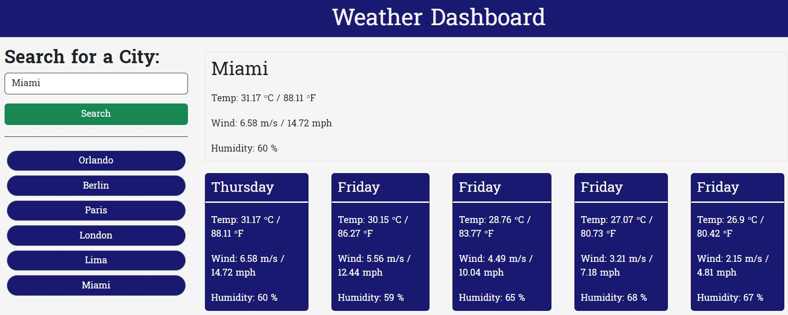

# Weather Dashboard

## Description
A weather dashboard that runs in the browser and features dynamically updated HTML and CSS. I built it with the idea to help travelers to see the weather outlook for multiple cities
so that they can plan trips accordingly. This way they can prepare properly and prevent any bad weather ruining their day or trip. I learned that API's are a really powerful and useful tool as well as that we as developers build our work on top of other's developer's work.

## Table of Contents
- [Installation](#installation)
- [Usage](#usage)
- [Credits](#credits)
- [License](#license)
- [How to Contribute](#how-to-contribute)
- [Tests](#tests)

## Installation
This project does not require an installation. However, you are welcome to to either clone the repository and access the project files or fork the repo.

## Usage
Deployed on [GitHub Pages](https://andresalbornozgil.github.io/weather-dashboard/)

Once on the landing page, you will see a search bar on the upper right corner of the page. Input any city and the current as well as weekly forecast will diplay on the center of the page.

Every city you have searched for will be displayed underneath the search bar. If you click on any of those cities, their daily weather and weekly forecast will be displayed as well.

## Credits
Andres Albornoz

## License
This project is unlicensed.

## How to Contribute
If after taking a look at my portfolio you would like to work on any project together, feel free to reach out!

## Tests
Tested at the time of deployment.
